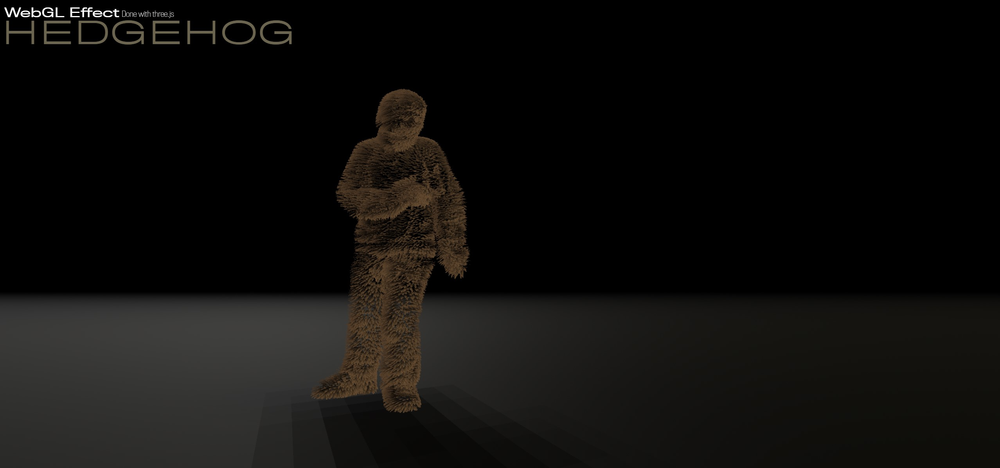

# Hedgehog

Three.js experiment with custom shader to render hedgehog fur like.

## Description

This project show how to setup a custom material using [three.js](https://threejs.org/).

You can control the camera using mouse. 

## Youtube video

Check the [video](https://youtu.be/0U3P79HGuvw) on youtube.